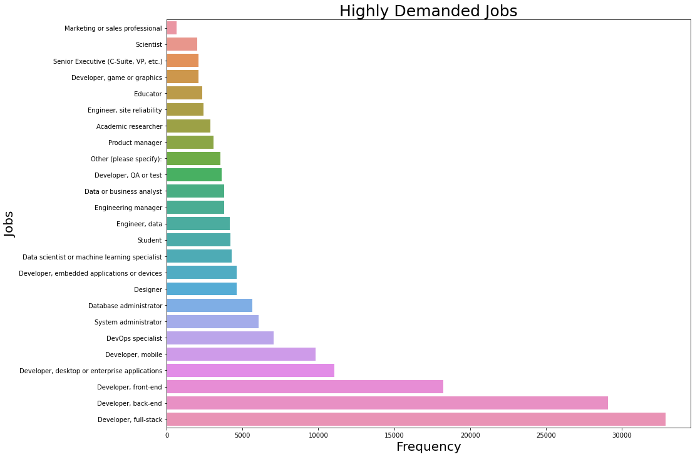

# Talent Tracking : Project Overview
 
The idea for this project stemmed from reading and watching various podcasts that provided insights on the necessary skills for individuals looking to transition into the field of Data Science.

Utilizing the Stack Overflow survey, I aim to develop a data-driven solution that can answer questions such as:
"Do I need to learn C++ to become a Data Scientist?"

If you're curious to see a demo, please visit the following link https://www.linkedin.com/posts/mohamed-hmamouch_are-you-wondering-if-you-need-to-learn-c-activity-7061980706205265922-oCgx?utm_source=share&utm_medium=member_desktop: 

# Dataset :

- The dataset contains responses from the Stack Overflow Annual Developer Survey.
- The purpose of the dataset is to provide insights into the skills, experience, and demographics of developers worldwide.
- The dataset includes information on employment status, education level, programming experience, and compensation.
- It covers respondents from various countries, including the USA, India, Germany, Sweden, and Canada.
- The dataset contains over 80,000 responses from developers across the globe.

- Relevent columns : 
  - DevType
  - LanguageHaveWorkedWith
  - LanguageWantToWorkWith
  - DatabaseHaveWorkedWith
  - PlatformHaveWorkedWith
  - WebframeHaveWorkedWith
  - MiscTechHaveWorkedWith
  - ToolsTechHaveWorkedWith

# I- EDA
## Questions to Explore the Data
- General:
  - Total number of responses
  - Geographic distribution of respondents
  - Rate of missing answers
- Skills:
  - Frequency of each skill in the dataset
  - Correlation between different skills
- Jobs:
  - Frequency of each job title in the dataset
  - Correlation between different job titles
- Relationship:
  - Correlation between skills and job titles
  - Specificity of each skill to a job title

## Figures

- Highly demanded jobs based on dataset : 
 
 
 
 - Looking for most demanding skills in each groups 
   
   
  - Relation between skills and jobs 
      
      
      
  - Relation between Jobs : 
    - Something weird, backend and front-end should be close or in a cluster, we see here that backend dev are close to quality assurance. The solution is to normalize the data and it gives the second figures
   
      
      
      
      
      
      
      
 - Common skills for each job : 
 
    

# II- Feature Engineering

- In this section, I have attempted to cluster the tools used by each profile. The aim is to create a reference for each job, which will assist in determining which profile to place based on their skills, as well as to provide recommendations. I used T-sne to visualize different groups, and K-means to create clusters.

- Dimentionality reduction using T-sne

      
      
      
      
- Possible clusters after k-means
         

         
         
         
- Clusters of tools  

# Modeling 

- I encountered a major issue while modeling and recommending skills due to the large size of my dataset compared to my resources. In order to address this issue, I have decided to implement a simple algorithm without hyperparameter tuning. Although the code is available in notebooks, the algorithm needs to be deployed into production through a Flask or Dash app. My objective is to track the model's progress using Mlflow.
                      
                    
# Handling class imbalanced

- One way to address this issue is by using class weights. Class weights assign higher weights to the minority class and lower weights to the majority class during the training process, thereby giving more importance to the minority class. In the given code, the class weights are calculated by taking the inverse of the sum of the samples in each class.

- Figures of imbalanced : 

- Handling imbalanced using class weight

                  
      
      
      
      
      

      
      

  
  

  

